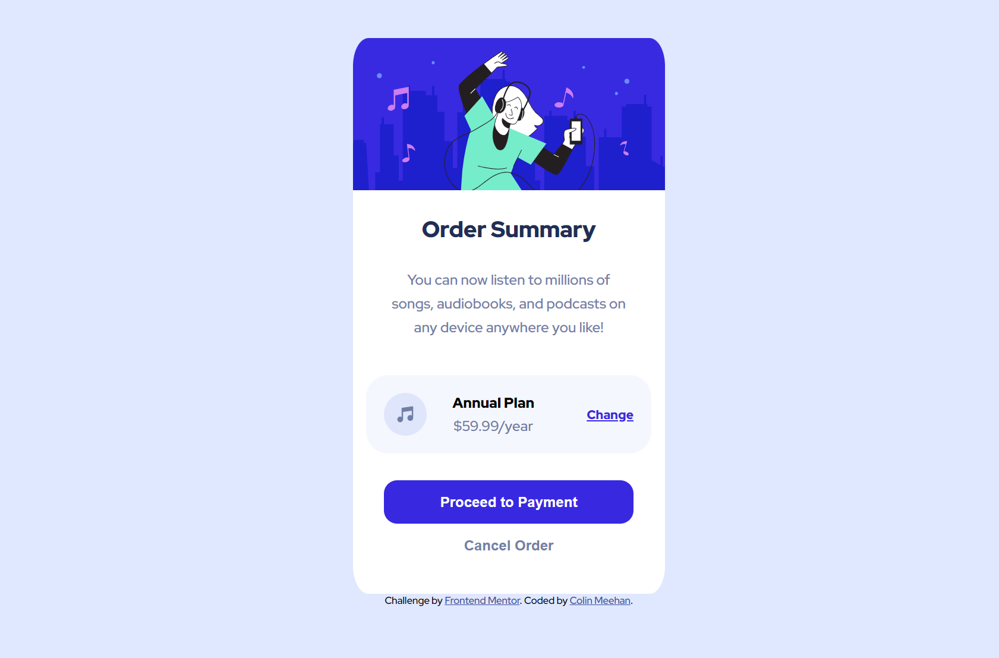

# Frontend Mentor - Order summary card solution

This is a solution to the [Order summary card challenge on Frontend Mentor](https://www.frontendmentor.io/challenges/order-summary-component-QlPmajDUj). Frontend Mentor challenges help you improve your coding skills by building realistic projects. 

## Table of contents

- [Overview](#overview)
  - [The challenge](#the-challenge)
  - [Screenshot](#screenshot)
  - [Links](#links)
- [My process](#my-process)
  - [Built with](#built-with)
  - [What I learned](#what-i-learned)
  - [Useful resources](#useful-resources)
- [Author](#author)
- [Acknowledgments](#acknowledgments)

**Note: Delete this note and update the table of contents based on what sections you keep.**

## Overview

### The challenge

Users should be able to:

- See hover states for interactive elements

### Screenshot



### Links

- Solution URL: [Add solution URL here](https://github.com/ucolinmee/frontendmentor-orderSummaryComponent)
- Live Site URL: [Add live site URL here](https://ucolinmee.github.io/frontendmentor-orderSummaryComponent/)

## My process

### Built with

- Semantic HTML5 markup
- CSS custom properties
- Flexbox

### What I learned

One major learning point I made was nesting a column flexbox within a row flexbox in order to display the card-plan section. This taught me the flexibility of aligning items in a row, while still being able to place some items on top of one another. 


```html
<div class="card-plan">
  
  <div class="card-plan-description">
    <p class="plan">Annual Plan</p>
    <p class="rate">$59.99/year</p>
  </div>
  <a href="">Change</a>
</div>
```
```css
.card-plan {
    background-color: hsl(225, 100%, 98%);
    display: flex;
    justify-content: space-between;
    align-items: center;
    width: 80%;
    border-radius: 25px;
    padding: 20px;
}

.card-plan-description {
    display: flex;
    flex-direction: column;
    margin-right: 30px;
}
```